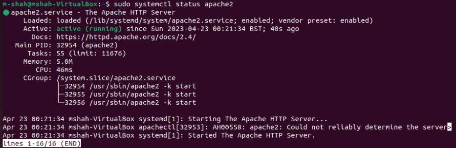

## Documentation of Project 1 

	`sudo apt update`

    `sudo apt install apache2`
    
    `sudo systemctl status apache2`
    
    

    [open SSH-key management](https://learn.microsoft.com/en-us/windows-server/administration/openssh/openssh_install_firstuse?tabs=powershell)

    [install open ssh](tration/openssh/openssh_install_firstuse?tabs=powershell#install-openssh-for-windows)
    

    